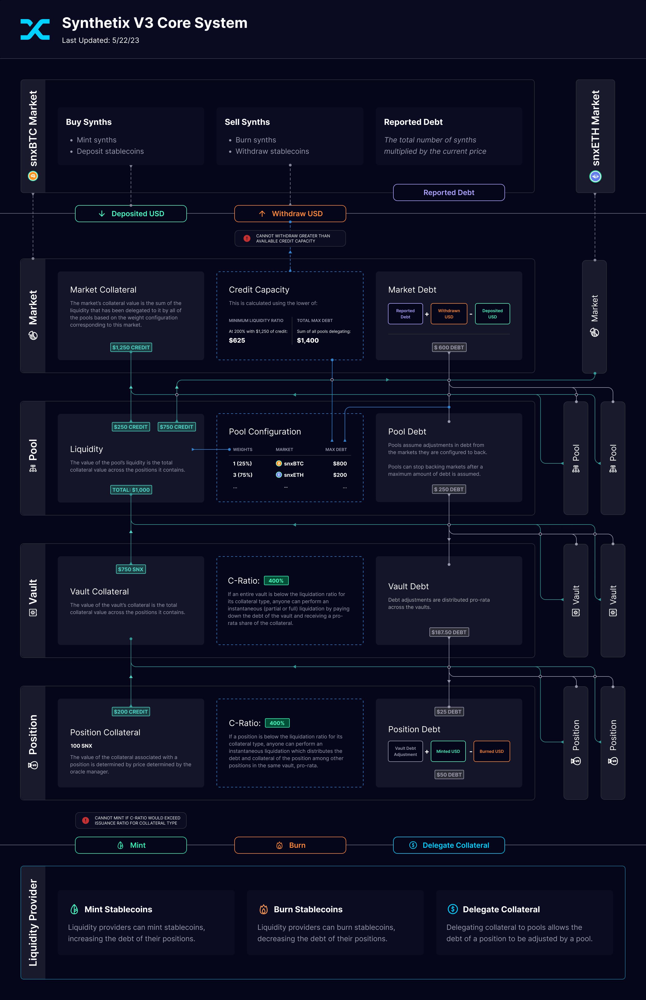

# Overview


**Synthetix V3 is currently in alpha**

* Some v3 functions are yet to be enabled, see [development-progress.md](development-progress.md "mention")
* If you were looking for V2, visit the V2 documentation [here](https://docs.synthetix.io/synthetix-protocol).


**Synthetix** is an [open source](https://github.com/synthetixio/synthetix-v3), decentralized finance (DeFi) protocol written in Solidity, which can be deployed on EVM-compatible blockchains. The protocol is [governed by DAOs](for-governance-participants/synthetix-governance.md), including the Spartan Council which votes on [upgrades and configuration changes (SIP/SCCPs)](https://sips.synthetix.io/). See the current deployments' [Addresses + ABIs](for-developers/addresses-+-abis.md).

The protocol allows **liquidity providers** to delegate collateral to **liquidity pools**. They can then take out a loan of snxUSD stablecoins. This mechanism is similar to other DeFi protocols which implement collateralized debt positions, such as [Liquity](https://www.liquity.org/).

Unique to Synthetix is the ability for **liquidity pool managers** to configure these pools to extend credit to **derivatives markets**. These markets generally rely on decentralized oracle networks (such as [Chainlink](https://chain.link/) and [Pyth](https://pyth.network/)) to retrieve the price of off-chain assets and issue on-chain derivatives of these assets. Analogous to [Uniswap](https://uniswap.org/), in exchange for extending credit to markets (allowing them to always fill orders for traders), markets can collect and deposit fees. This creates an incentive for liquidity providers by reducing the debt of their positions.

Anyone can interact with the [Synthetix V3 core system](https://v3.synthetix.io/) and the Synthetix V3 [market implementations](https://synthetix-markets-prototype.vercel.app/).

<figure><figcaption></figcaption></figure>
