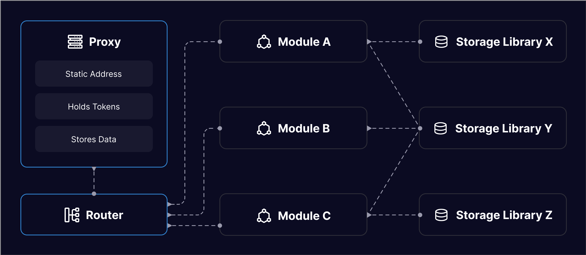

# Technical Architecture

Synthetix V3 consists of a collection of separate system. Each system includes a UUPS proxy contract, an automatically generated router contract, a series of module contracts, and a series of storage library contracts.

<figure><figcaption></figcaption></figure>

## Router Generator

Router contracts are automatically generated using custom tooling which can be found in the [`utils/router` folder in the Synthetix V3 repository](https://github.com/Synthetixio/synthetix-v3/tree/main/utils/router). See the README there for more information.

Note that [Etherscan](https://etherscan.io/) does not yet have support for this proxy architecture when generating Read/Write Contract user interfaces. Instead, you can use a similar tool in the [Cannon registry explorer](https://usecannon.com/packages/synthetix-omnibus/interact#QmPc9UnkKfU53AXepBEZjYdAyA5ErPV4wK1yNcsAD5dEW9).

## Storage Libraries

Systems use a series of storage libraries, analogous to models in MVC frameworks. These contracts typically load and save a struct from a specified storage slot. See the [Collateral Configuration storage library](https://github.com/Synthetixio/synthetix-v3/blob/main/protocol/synthetix/contracts/storage/CollateralConfiguration.sol) as an example.

Data runs a risk of corruption if a storage library is upgraded in an invalid way. (For example, rearranging the order of items in the struct will cause unintended side-effects.)

To protect against this, [this Hardhat plug-in validates storage updates](https://github.com/Synthetixio/synthetix-v3/tree/main/utils/hardhat-storage) in the continuous integration pipeline.

Storage libraries are also not straightforward to interact with in unit testing. To help resolve this challenge, the plug-in also includes a [`generate-testable` task](https://github.com/Synthetixio/synthetix-v3/blob/main/utils/hardhat-storage/src/tasks/generate-testable.ts) which automatically creates a smart contract with getter and setter methods for the specified storage library.

## Video Overview


