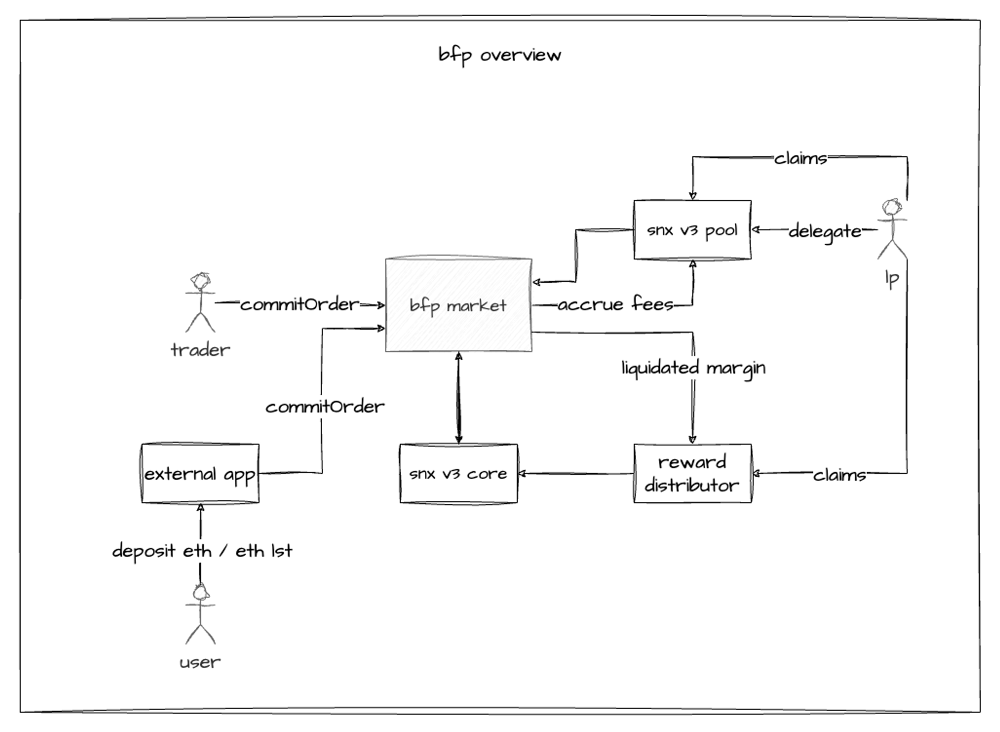
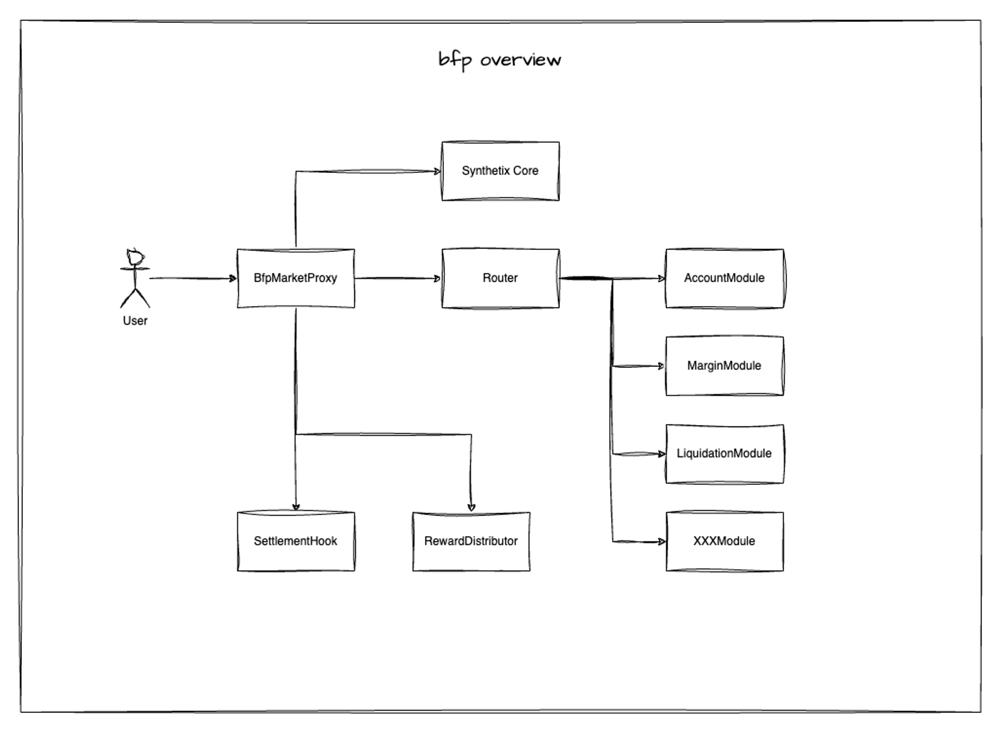

# L1 Perp (BFP)

This document aims to be an introductory guide for frontend trading, vault builders, bot builders, market makers, and traders with technical knowledge to integrate with the bfp market contracts.


The project is open source and you can find all source on GitHub [https://github.com/Synthetixio/synthetix-v3/tree/main/markets/bfp-market](https://github.com/Synthetixio/synthetix-v3/tree/main/markets/bfp-market). Note contract interfaces mentioned here may be out of date. Please refer to the source code on GitHub or better, inspect the contracts directly on cannon or Etherscan.


## What is bfp?

bfp-market or “Big Freaking Perp”-market is a perp market built on top of Synthetix v3. bfp-market, similar to other markets like spot-market, perps-market, and legacy-market are all markets designed, developed, and maintained internally by Synthetix core contributors.

If you are familiar with perps-market ([Perps V3](perps-v3.md)), bfp-market will look and feel very familiar. Both bfp-market and perps-market inherit the same design and mechanisms behind async orders, liquidations, margin management, accounting, account management etc. However, there are subtle differences, particularly in the interface and implementation. For instance the codebase between the two markets are also entirely different.

The original design intent behind bfp-market is to accommodate the creation of delta neutral positions utilising ETH and ETH LSTs as collateral. This gives way to a tokenised yield bearing (through positive funding) and hyper-stable collateral that then can be used for further DeFi (stable coins, additional leverage, etc.). All of this done completely decentralised and onchain.

The primary difference between perps-market and bfp-market is the intended use case. While perps-market is designed and intended to be a general purpose perpetual futures market with native cross margin support, spot-synths as collateral, with 100+ markets, bfp-market’s intent is very different.

The design intent between both markets lead to features that exist in bfp-market which do not exist in perps-market and vice versa. It also influences the destination contracts are deployed to (Ethereum L1 vs L2s), margin management (isolated only vs. cross margin) and the number of markets (just ETHPERP vs. 100+ markets).


bfp-market deployment artifacts are published to [cannon](https://usecannon.com/). You can see the full deployment artifact in the cannon registery under the [synthetix-bfp-market](https://usecannon.com/packages/synthetix-bfp-market) package.


### Overview

<figure><figcaption><p>bfp-market overview</p></figcaption></figure>

Above describes the components that connect to/with bfp-market:

* Just one pool with SNX and ETH collateral deposits that back bfp-market
* bfp-market registered to v3 core contracts for `snxUSD` minting/burning, deposits, withdraw etc.
* Each margin collateral has one reward distributor for liquidation rewards distributed to LPs
* Traders/integrators post orders directly against the bfp-market proxy
* Not shown here are a decentralised network of keepers for order settlement and liquidations

### Contracts

<figure><figcaption><p>Structural code components</p></figcaption></figure>

Contract architecture is the same across all v3 markets. A static UUPS proxy contract is the entry point for all user interaction. A router contract is generated through cannon and synthetix-router using a composition of `XXXModule` contracts.


Contract addresses can also be found in the cannon registry.


## Basic features

Below we describe the differences between bfp-market and Perps V3. It's important you familiarise yourself with Perps V3 before reading this. However, there is enough context that you can read through and grok majority of bfp-market.

### How do I modify margin?

Before you can open positions, you must first deposit margin. This is done with the `modifyCollateral` function.

```solidity
struct ConfiguredCollateral {
    /// Address of the collateral asset.
    address collateralAddress;
    /// The underlying spot market synth sell oracle node id.
    bytes32 oracleNodeId;
    /// Maximum allowable deposited amount.
    uint128 maxAllowable;
    /// Skew skewScale for the collateral.
    uint128 skewScale;
    /// Address of the associated reward distributor.
    address rewardDistributor;
}

function modifyCollateral(
    uint128 accountId,
    uint128 marketId,
    address collateralAddress,
    int256 amountDelta
) external;
```


Account margin is isolated by `marketId`. When you deposit a supported collateral into a trader’s margin account, that collateral can only be used by positions in that market.



`amountDelta` when positive is deposit whereas a negative is withdraw.



Note the subtle difference in `collateralAddress` vs `synthMarketId` and the lack of `marketId` in perps-market but present in bfp-market.&#x20;


bfp-market supports native multi-collateral margin. At launch we’re expecting to have support for `snxUSD` and `WETH` with LSTs such as `wstETH` to come later. The design of account margin is mostly similar to perps-market except for one subjective significance: **Native assets vs. spot-market issued synth assets.**

bfp-market, unlike perps-market, does not require non-USD collateral to be wrapped into a synth before it can be used for trading perps. That is, there is zero reliance on the spot-market and WETH for e.g. can be directly deposited. For builders this means integration should be a little simpler as you don’t need to call `wrap(marketId, wrapAmount, minAmountReceived)` and `unwrap(marketId, unwrapAmount, minAmountReceived)` before/after.

To see what margin is accepted, call:

```solidity
// See ConfiguredCollateral definition above.

function getMarginCollateralConfiguration()
    external
    view
    returns (ConfiguredCollateral[] memory);
```

There are also a variety of quality of life functions you can call against the account margin such as:

```solidity
function getWithdrawableMargin(
    uint128 accountId,
    uint128 marketId
) external view returns (uint256);

function getNetAssetValue(
    uint128 accountId,
    uint128 marketId,
    uint256 oraclePrice
) external view returns (uint256);

function withdrawAllCollateral(uint128 accountId, uint128 marketId) external;
```

All of these with docs and more can be found in `IMarginModule.sol`.

Finally, after depositing/withdrawing you can track the breakdown of deposited collateral and their value through `getAccountDigest`:

```solidity
struct AccountDigest {
    /// Array of collateral deposited into account as margin.
    IPerpAccountModule.DepositedCollateral[] depositedCollaterals;
    /// USD value of deposited collateral.
    uint256 collateralUsd;
    /// Debt of account in USD.
    uint128 debtUsd;
    /// Struct of `PositionDigest` if a position is open, default values if none.
    PositionDigest position;
}

function getAccountDigest(
    uint128 accountId,
    uint128 marketId
) external view returns (IPerpAccountModule.AccountDigest memory);
```

### How do I open, close, or modify a position?

To open a position, a call to commit an order for settlement must first be made. Positions are manipulated through orders, which are committed at time `t` and then settled at a later time (either by a keeper or the trader) at `t + n`, where `n` is defined as the `orderMinAge`, the minimum amount of time to wait before an order can be settled.

Call `commitOrder` to commit an order. The function is defined as:

```solidity
function commitOrder(
    uint128 accountId,
    uint128 marketId,
    int128 sizeDelta,
    uint256 limitPrice,
    uint128 keeperFeeBufferUsd,
    address[] memory hooks
);
```


`accountId` refers to the perp trading account. Call `createAccount` against the bfp-market proxy contract and fund it with margin before committing an order.



`sizeDelta` is in 1e18 native units so to long 5x ETH at the price of $3000 USD, you would specify 5e18 as the `sizeDelta` and have $3000 worth of margin deposited. A negative size delta is a short and to completely close out the position invert the current position size entirely (e.g. `position.size` is `-100e18` then to close set `sizeDelta=100e18`.



`limitPrice` and `keeperFeeBufferUsd` are USD denominated. Limit price can be used for slippage and price impact protection.&#x20;


There are two main differences aside from the interface. In perps-market, the `OrderCommitmentRequest` request argument accepts a `settlementStrategyId` whereas bfp-market does not. Also bfp-market has a concept of `hooks`, whilst perps-market does not.

bfp-market is simpler here as there’s only one method of order settlement and the logic of this is entirely baked into the internals of the market. However perps-market allow for better extensibility for future settle strategies as they allow you pick and choose between many settlement strategies, with just one currently supported.


Settlement hooks are a bfp-market exclusive feature (see settlement hooks section below for more details).


### What are the fees involved?

Fees are paid to pool delegators that back the market and paid out of the account margin. Such fees include settlement fees. bfp-market settlements are async which means you won't know exactly what the fees would be until they settle. This is because they’re impacted by gas prices, market prices, market skew at the time of settlement etc. You can retrieve the estimated order and keeper fees by calling:

Settlement fees on commitment are an estimate of what they would actually be on settlement.&#x20;

```solidity
function getOrderFees(
    uint128 marketId,
    int128 sizeDelta,
    uint128 keeperFeeBufferUsd
) external view returns (uint256 orderFee, uint256 keeperFee);
```


`keeperFeeBufferUsd` is an additional tip that's paid keepers as incentive to execute this order. This is paid out of the account's margin. Set this to 0 to only spend what is necessary.


### How do I accessing my pending order?

Once an order has been successfully submitted, you can view the order by calling:

```solidity
struct OrderDigest {
    /// Size to modify when settled
    int128 sizeDelta;
    /// block.timestamp of when the order was committed
    uint64 commitmentTime;
    /// The max acceptable price tolerance for settlement
    uint256 limitPrice;
    /// A tip in USD to pay for settlement keepers
    uint128 keeperFeeBufferUsd;
    /// A list of whitelisted hook addresses to invoke after settlement
    address[] hooks;
    /// True if order expired and must be canceled, false otherwise
    bool isStale;
    /// True if order can be settled, false otherwise
    bool isReady;
}

function getOrderDigest(
    uint128 accountId,
    uint128 marketId
) external view returns (IOrderModule.OrderDigest memory);
```

### How is the order settled after commitment?

After an order has been committed, it must be settled before `commitmentTime + w` where `w` is defined as the `orderMaxAge`, which if `block.timestamp` has approached, then the order is considered stale and must be cancelled before a new order can be committed. Orders are usually settled through a network of incentivised keepers. Assuming an order has not bee expired then a call to `settleOrder` settle the order and a new position is created if none was present earlier or modifed if exists.

`settleOrder` is defined as:

```solidity
function settleOrder(
    uint128 accountId,
    uint128 marketId,
    bytes calldata priceUpdateData
) external payable;
```


However sometimes (although rarely), a trader may need to settle their own order e.g. during times of high network activity. So frontend builders should always provide a way for the trader who submitted the order to also settle their order.


This leads to the next major difference. If you’re familiar with perps-market, you would have grown accustomed to ERC7412 ([https://eips.ethereum.org/EIPS/eip-7412](https://eips.ethereum.org/EIPS/eip-7412)). Pyth price oracles are used throughout perps-market, which depending on the price staleness tolerance sometimes may require price updates before performing mutations or even views.

bfp-market on the other hand does not use ERC7412, and only uses Pyth oracles during settlement for the freshest price possible onchain. Instead, Chainlink oracles are used for every other part of the market and we are reliant on Chainlink to maintain price freshness. This means integrators and builders largely do not need to worry about price staleness, only the settlement keepers do.

The perps-market’s settlement function(s) are fairly different with bfp-market. Unlike `settle` and `settlePythOrder`, bfp-market just has a single `settleOrder` function to accept an `accountId`, marketId and a Pyth price update VAA in `priceUpdateData` for settlement.


You can find the Pyth price update data via the Hermes API [https://docs.pyth.network/price-feeds/api-instances-and-providers/hermes](https://docs.pyth.network/price-feeds/api-instances-and-providers/hermes)


Another subtle difference is how fees are paid to keepers for settlement. Upon settlement, perps-market, will withdraw a portion of margin to sell on the spot-market to cover fees paid to keepers. This is quite an expensive operation for bfp-market. Instead, bfp-market tracks a running `debtUsd` on the account margin for accounting to minimise gas on settlements (see account debt below for more details). The fees are simply added to the accrued debt.

### What price should I be using to settle?

Position modification occurs in two steps: commit, settlement. However, the time between commit and settle can vary depending on chain congestion. If we assume block production is 12s and settlement occurs at the block immediately after settlement then this allows the caller of `settleOrder` to choose a price between commitment time `t` and `t + 12`.

To eliminate keeper settlement optionality, the earliest price available in Pythnet between `t` and `t + 12` must be used as the `priceUpdateDate`. This is validated onchain during settlement and a revert will be thrown if the earliest price isn't provided.&#x20;

### How do I view my position?

Once a position has been settled, you can view the position with `getPositionDigest`:

```solidity
struct PositionDigest {
    /// Id of the account that was queried.
    uint128 accountId;
    /// Id of the market that was queried.
    uint128 marketId;
    /// Total remaining margin for position in USD.
    uint256 remainingMarginUsd;
    /// Health factor for position in market if a position is open.
    uint256 healthFactor;
    /// Notional value of position in USD.
    uint256 notionalValueUsd;
    /// Unrealized PnL of position in USD.
    int256 pnl;
    /// Funding accrued in USD.
    int128 accruedFunding;
    /// Utilization accrued in USD.
    uint128 accruedUtilization;
    /// Raw Pyth entry price of position (at open or on modification).
    uint256 entryPythPrice;
    /// pd-adjusted entry price of position (at open or on modification).
    uint256 entryPrice;
    /// Current oracle price of market this position.
    uint256 oraclePrice;
    /// Position size in native units (not USD).
    int128 size;
    /// Initial margin (IM) requirement.
    uint256 im;
    /// Maintenance margin (MM) requirement.
    uint256 mm;
}

function getPositionDigest(
    uint128 accountId,
    uint128 marketId
) external view returns (IPerpAccountModule.PositionDigest memory);
```

### How do I cancel an order?

After an order is committed, it is rarely ever cancellable. However, sometimes orders cannot settle for a combination of reasons. The most common are:

1. The `fillPrice` deviated too far from the `limitPrice` on commitment
2. Keepers took too long to settle and order is now stale
3. Insufficient margin on settlement (e.g. price slipped and now leverage too high)

In these situations, bfp-market provides 2 ways to cancel an order. One directed at keepers and the other for traders:

```solidity
// Keeper
function cancelOrder(
    uint128 accountId,
    uint128 marketId,
    bytes calldata priceUpdateData
) external payable;

// Trader
function cancelStaleOrder(uint128 accountId, uint128 marketId) external;
```


Lingering stale orders can potentially lead to market ddos where malicious orders flood the market and keepers become inundated with orders, preventing them from settlement.


The `cancelOrder` function provided with a Pyth price update VAA in `priceUpdateData`, allows a keeper (or anyone) to cancel an order before `maxOrderAge` has been met so long as the `limitPrice` has been exceeded. This prevents the build up of orders with egregious `limitPrices` to stay stale, potentially clogging up keepers. Keepers are incentivised to cancel such orders as penalties from the trader’s margin are rewarded to keepers. Conversely traders are disincentivised as they pay a fee for doing so.

`cancelStaleOrder`, similar to perps-market, simply cancels a stale order. This is often not necessary assuming keepers are functioning but can sometimes occur (for the reasons above).

## Advanced features

### What are margin discounts?

Non-USD collateral is discounted in bfp-market. The discount is calculated as:

```
price * (1 - min(max((amount * scalar) / skewScale, minDiscount), maxDiscount))
```

The reason we do this is for risk management purposes. Each collateral type is configured to have a different discount. We also provide a view function to calculate this onchain:

```solidity
function getDiscountedCollateralPrice(
    address collateralAddress,
    uint256 amount
) external view returns (uint256);
```

For an aggregated discounted collateral or remaining margin (which incorporates account debt and unrealized PnL), you can call:

```solidity
struct MarginValues {
    /// USD value of deposited collaterals (adjusted collateral price) -fees, -funding, -utilization, +PnL.
    uint256 discountedMarginUsd;
    /// USD value of deposited collaterals (unadjusted collateral price) -fees, -funding, -utilization, +PnL.
    uint256 marginUsd;
    /// USD value of deposited collaterals (adjusted collateral price)
    uint256 discountedCollateralUsd;
    /// USD value of deposited collaterals  (unadjusted collateral price)
    uint256 collateralUsd;
}

function getMarginDigest(
    uint128 accountId,
    uint128 marketId
) external view returns (Margin.MarginValues memory);
```

Although collateral discounts are present in perps-market, bfp-market puts a stronger emphasis on collateral discounts. This is because native multi-collateral is core to creating delta neutral positions (e.g. ETH margin 1x ETH short on ETHPERP market).

### What is collateral utilization?

In bfp-market, we call this collateral utilization but it’s called “asymmetric funding” or “interest rates” in perps-market.


Collateral utilisation are the same feature as described in SIP-354 ([https://sips.synthetix.io/sips/sip-354/](https://sips.synthetix.io/sips/sip-354/)).


perps-market provides separate getter/settings but bfp-market simply includes that in the market configuration:

```solidity
struct GlobalMarketConfigureParameters {
    // ...
    uint128 utilizationBreakpointPercent;
    uint128 lowUtilizationSlopePercent;
    uint128 highUtilizationSlopePercent;
    // ...
}

function setMarketConfiguration(
    IMarketConfigurationModule.GlobalMarketConfigureParameters memory data
) external;

function getMarketConfiguration()
    external
    view
    returns (PerpMarketConfiguration.GlobalData memory);
```

And similarly our `updateInterestRate` is consistently named (as with `recomputeFunding`) `recomputeUtilization`:

```solidity
function recomputeUtilization(uint128 marketId) external;
```

To query utilization, call `getUtilizationDigest`:

```solidity
struct UtilizationDigest {
    /// Last computed utilization rate.
    uint128 lastComputedUtilizationRate;
    /// Timestamp of last computed utilization rate.
    uint64 lastComputedTimestamp;
    /// The current instantaneous utilization rate.
    uint128 currentUtilizationRate;
    /// The current instantaneous collateral utilization.
    uint256 utilization;
}

function getUtilizationDigest(
    uint128 marketId
) external view returns (IPerpMarketFactoryModule.UtilizationDigest memory);
```

### What is account debt?

Account margin debt is largely accrued from negative PnL (i.e. losses on one or many poor trades). Each time a position is modified (by increasing or decreasing size), `accountMargin.debtUsd` is incremented (when there are losses) or decremented (when there are profits) with excess profits added to `accountMargin[snxUSDAddress] += excess`.

Doing so avoids the need to sell non-USD collateral on every update where losses were incurred (or when snxUSD isn’t present to pay fees). More importantly, it also gives the trader flexibility to decide if they would like to maintain or reduce the non-USD collateral exposure. However, this flexibility introduces a new problem, account margin liquidation and debt payback.


Note the same mechanism exists in perp-market as described in SIP-383 ([https://sips.synthetix.io/sips/sip-383/#liquidationmodule](https://sips.synthetix.io/sips/sip-383/#liquidationmodule)).


```solidity
function payDebt(uint128 accountId, uint128 marketId, uint128 amount) external;

function liquidateMarginOnly(uint128 accountId, uint128 marketId) external;

function getMarginLiquidationOnlyReward(
    uint128 accountId,
    uint128 marketId
) external view returns (uint256);
```

The only difference between bfp-market and perps-market is we also require a marketId as our margin is isolation. We also provide a `getMarginLiquidationOnlyReward` view to retrieve the liquidation rewards for keepers.

### What is funding & funding rate velocity?

This the backbone of the Synthetix perps mechanism. It follows the same design described in PerpsV2 and PerpsV3. In bfp-market, the core of funding and funding rate velocity is also mechanistically the same with one subtle difference. bfp-market introduces a `fundingVelocityClamp`, the clamp pushes the funding rate to zero if the skew is within a configurable acceptable threshold above or below zero. Basically:

```solidity
int256 pSkew = self.skew.divDecimal(skewScale);
if (MathUtil.abs(pSkew) < marketConfig.fundingVelocityClamp) {
    return 0;
}
```

We think that as skew contracts closer to zero, there is less incentive to arb the funding. So rather than have the funding rate drift very slowly in one direction, prevent it from moving at all to give integrators a more stable funding rate.


You can read the original SIP which describes the mechanism in [https://sips.synthetix.io/sips/sip-279/](https://sips.synthetix.io/sips/sip-279/)



You can also read the original Synthetix v2x docs [Synthetix V2X - User Docs](https://app.gitbook.com/o/CgKKbcaDraUAYIovoOdl/s/DwqzB5BTWasJXBHd4rXZ/ "mention")


### How are positions liquidated?

Liquidation between bfp-market and perps-market are, as you guessed, also mechanistically identical. Markets have a maximum liquidation capacity scoped by a sliding window viewed by:

```solidity
function getRemainingLiquidatableSizeCapacity(
    uint128 marketId
)
    external
    view
    returns (
        uint128 maxLiquidatableCapacity,
        uint128 remainingCapacity,
        uint128 lastLiquidationTimestamp
    );
```

They also have certain bypasses such as the endorsed keeper and when skew is within a `liquidationMaxPd` configuration. We provide a few utility view functions to dig into the health of a position such as:

```solidity
// Used in combination with discountedMaringUsd from getMarginDigest
function getLiquidationMarginUsd(
    uint128 accountId,
    uint128 marketId,
    int128 sizeDelta
) external view returns (uint256 im, uint256 mm);

function getHealthFactor(uint128 accountId, uint128 marketId) external view returns (uint256);

function isPositionLiquidatable(
    uint128 accountId,
    uint128 marketId
) external view returns (bool);
```

Also similarly, liquidated position margin (aside from snxUSD) are distributed to LPs and claimed via reward distributors. However, the main difference is the keeper interaction for flagging and liquidating.

```solidity
function flagPosition(uint128 accountId, uint128 marketId) external;

function liquidatePosition(uint128 accountId, uint128 marketId) external;
```

A position must be first flagged before it can be liquidated. perps-market also has the concept of a flagged position but it’s partially abstracted away. When flagged, all account margin the `marketId` is either released as credit for LPs to claim (snxUSD) or distributed to LPs and a subsequent call to `liquidatePosition` will progressively close out the position to stay within liquidation caps.

Both `flagPosition` and `liquidatePosition` pay incentives to keepers from the account margin.

```solidity
function getLiquidationFees(
    uint128 accountId,
    uint128 marketId
) external view returns (uint256 flagKeeperReward, uint256 liqKeeperFee);
```

An estimate of fees required upon liquidation (plus buffer) is deducted from the trader’s remaining margin when determining their health factor.

### What are settlement hooks?

Settlement hooks are unique to bfp-market. They allow an external contract, which adheres to the [`ISettlementHook`](https://github.com/Synthetixio/synthetix-v3/tree/main/markets/bfp-market/contracts/interfaces/hooks) interface, to be called after an order has been settled within the same transaction.

During commitment, up to `k` hook contract addresses can be specified where `k` is configured by `maxHooksPerOrder`, expected to be set to 3 on launch.

```solidity
function commitOrder(
    uint128 accountId,
    uint128 marketId,
    int128 sizeDelta,
    uint256 limitPrice,
    uint128 keeperFeeBufferUsd,
    address[] memory hooks
) external;
```

These hook addresses are stored on the `Order.Data` struct and called during settlement.

Hooks must be whitelisted and they are validated during commitment and settlement. If a hook was deregistered between commitment and settlement, the settlement will fail to execute the hook. Additionally, if a hook cannot be executed successfully, the order settlement will revert.

On invocation, bfp-market calls `onSettle` on each hook present in the order, passing in the details of the account, market, and the unadjusted Pyth price used for settlement.

```solidity
function onSettle(uint128 accountId, uint128 marketId, uint256 oraclePrice) external;
```


The hook is invoked after both the order has been deleted and a new position has been created.


Settlement hooks are useful as they allow what should/must happen after settlement to occur atomically rather than in a separate transaction e.g. vaults can be called to update internal accounting, tokens can be minted against the NAV of the settled position etc.

#### Using account splitting and merging within hooks

Account splitting and merging is also another feature unique to bfp-market. They are typically used in conjunction with settlement hooks (particularly merging accounts which must be called from a hook). These functions are often useful to bypass the single order constraint, allow vaults and the like to aggregate operations into a single position, and splitting gives users execution optionality.

The two functions are defined as:

```solidity
function splitAccount(
    uint128 fromId,
    uint128 toId,
    uint128 marketId,
    uint128 proportion
) external;
    
function mergeAccounts(uint128 fromId, uint128 toId, uint128 marketId) external;
```

When you split an account with an open position, you pass in a proportion of size to split e.g. (0.5 = 50%) and the position will move into the account under `toId`, including 50% of the margin and debt.

When you merge an account, you merge the position from account A (`fromId`) into account B (`toId`), also including the debt and margin. These two functions allow you to for example, if you are a vault that would like to atomically issue vault shares:

1. On user deposit deposit into `YourVault`, `commitOrder(..., [YourSettlementHook])`
2. Wait `minOrderAge`
3. Keeper invokes `settleOrder`
4. `settleOrder` invokes `YourSettlementHook.onSettle` to merge your settled position into the `YourVault` position
5. `YourSettlementHook` calls `YourVault.mint(…)` based on the post settlement net asset value of the resulting merged position
6. Then, on withdraw the vault can call `splitPosition` with a proportion equal to size withdrawn into `toId` and give the user optionality to settle the order with their own `limitPrice`.
